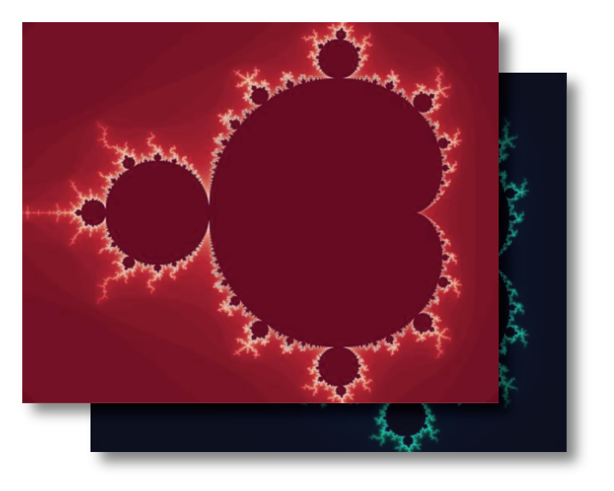
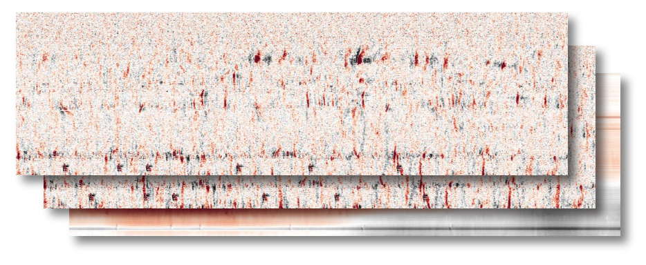

# figurl-tiled-image

View a stack of tiled images using deck.gl.

[See this example](https://figurl.org/f?v=gs://figurl/figurl-tiled-image-2&d=ipfs://QmYDC6aw1dD3NLyvMjzhoZgXaU7XNMRScQ8NLLGS2gacM9&label=Mandelbrot%20tiled%20image)

This project uses [kachery-cloud](https://github.com/scratchrealm/kachery-cloud) and [figurl](https://github.com/scratchrealm/figurl2).

> **IMPORTANT**: This package is intended for collaborative sharing of data for scientific research. It should not be used for other purposes.

## Installation and setup

It is recommended that you use a conda environment with Python >= 3.8 and numpy.

```bash
pip install --upgrade figurl_tiled_image
```

Or install from source:

```bash
git clone https://github.com/scratchrealm/figurl-tiled-image
cd figurl-tiled-image
pip install -e .
```

Configure your [kachery-cloud](https://github.com/scratchrealm/kachery-cloud) client (only do this once on your computer)

```bash
kachery-cloud-init
# follow the instructions to associate your client with your Google user name on kachery-cloud
```

## Basic usage

From Numpy array:

```python
import numpy as np
from figurl_tiled_image import TiledImage

array1 = ... # create a color image numpy array [N1 x N2 x 3] uint8
array2 = ... # create a color image numpy array [N1 x N2 x 3] uint8

X = TiledImage(tile_size=4096)
X.add_layer('layer 1', array1)
X.add_layer('layer 2', array2)
url = X.url(label='Numpy example')
print(url)
```

From image file:

```python
import pyvips
from figurl_tiled_image import TiledImage

filename1 = '/path/to/some/image1.png' # substitute the path to your image
image1 = pyvips.new_from_file(filename1)

filename2 = '/path/to/some/image2.png' # substitute the path to your image
image2 = pyvips.new_from_file(filename2)

X = TiledImage(tile_size=4096)
X.add_layer('layer 1', image1)
X.add_layer('layer 2', image2)
url = X.url(label='Example')
print(url)
```

## Example - Mandelbrot set



See [examples/multipanel_mandelbrot.py](examples/multipanel_mandelbrot.py) and [examples/multipanel_mini_mandelbrot.py](examples/multipanel_mini_mandelbrot.py)

## Example - Visualization of ephys data



See [examples/spikeinterface_example.py](examples/spikeinterface_example.py) (requires [SpikeInterface](https://github.com/SpikeInterface/spikeinterface) installation and access to raw data file).

<!-- ## Example - High res. earth from NASA and NOAA

See [examples/high_res_earth_from_url.py](examples/high_res_earth_from_url.py)

[View resulting figURL - Earth](...) -->

## For developers

The front-end code is found in the [gui/](gui/) directory. It uses typescript/react and is deployed as a [figurl](https://github.com/scratchrealm/figurl2) visualization plugin.

You can run a local development version of this via:

```bash
cd gui
# One-time install
yarn install 

# Start the web server
yarn start
```

Then replace `v=gs://figurl/figurl-tiled-image-2` by `v=http://localhost:3000` in the URL you are viewing. Updates to the source code will live-update the view in the browser. If you improve the visualization, please contribute by creating a PR.
